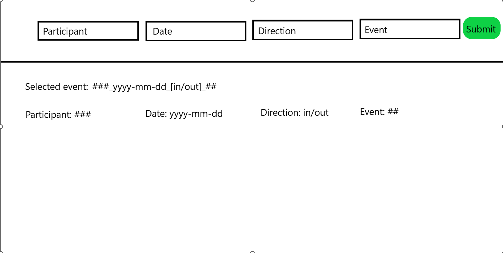

# Select Swipe Event: Frontend

## Overview

For the frontend in this project, a separate **Dash** service will make API calls to the backend **Flask API**.  
In the **Select Swipe Event** story, the dashboard should provide controls for the user to select a swipe event using dropdown menus.

Refer to the **Dash Layout** and **Basic Callback** tutorials to learn how to:
- Define the layout for the dashboard.
- Trigger API calls when Dash components are changed or interacted with.

The following sections describe the required functions and layout mock-up for the summary page.

---

## Tasks

### 1. Create Layout

The layout should include dropdown controls and a submit button for swipe event selection. An example of the layout can be found below


**Components to include:**
- `html.Dropdown` for each selection menu.
- `html.Button` for submission.
- `dcc.Interval` to trigger the initial data fetch.

**Component IDs:**
| Element | ID |
|----------|----|
| Participant dropdown | `participant-dropdown` |
| Date dropdown | `date-dropdown` |
| Direction dropdown | `direction-dropdown` |
| Events dropdown | `events-dropdown` |
| Submit button | `submit-button` |
| Interval object | `page-load-interval` |

**Interval behavior:**
- Use `dcc.Interval` to trigger the first fetch of participants.
- Set `max_intervals=1` and `id="page-load-interval"`.
- When the page loads, this object starts counting intervals, triggering the callback function for participant data.

---

### 2. Create Callback Functions

All callback functions use **Dash’s async callbacks** to fetch and update dropdown data dynamically.

**Imports:**
```python
from dash import Dash, html, Input, Output, State, callback
import asyncio
```

---

### Participant Fetch

Fetch available participants when the dashboard loads.

```python
@callback(
    Input(component_id="page-load-interval", component_property="interval"),
    Output(component_id="participant-dropdown", component_property="options"),
)
async def getParticipants(_):
    pass
```

---

### Dates Fetch

Fetch available dates based on the selected participant.

```python
@callback(
    Input(component_id="participant-dropdown", component_property="value"),
    Output(component_id="date-dropdown", component_property="options"),
)
async def getDates(participant):
    pass
```

---

### Events Fetch

Fetch available directions (`in`, `out`) and their associated swipe events.  
The expected response format is:

```json
{
  "directions": ["in", "out"],
  "events": {
    "in": [1, 2, 3, ...],
    "out": [1, 2, 3, ...]
  }
}
```

Callback function:

```python
@callback(
    State(component_id="participant-dropdown", component_property="value"),
    Input(component_id="date-dropdown", component_property="value"),
    Output(component_id="direction-dropdown", component_property="options"),
    Output(component_id="events-dropdown", component_property="options"),
)
async def getEvents(participant, date):
    pass
```

---

### Swipe Event Fetch

Fetch the selected swipe event metadata when the submit button is clicked.

```python
@callback(
    Input(component_id="submit-button", component_property="n_clicks"),
    State(component_id="participant-dropdown", component_property="value"),
    State(component_id="date-dropdown", component_property="value"),
    State(component_id="direction-dropdown", component_property="value"),
    State(component_id="events-dropdown", component_property="value"),
)
async def getSwipe():
    pass
```
